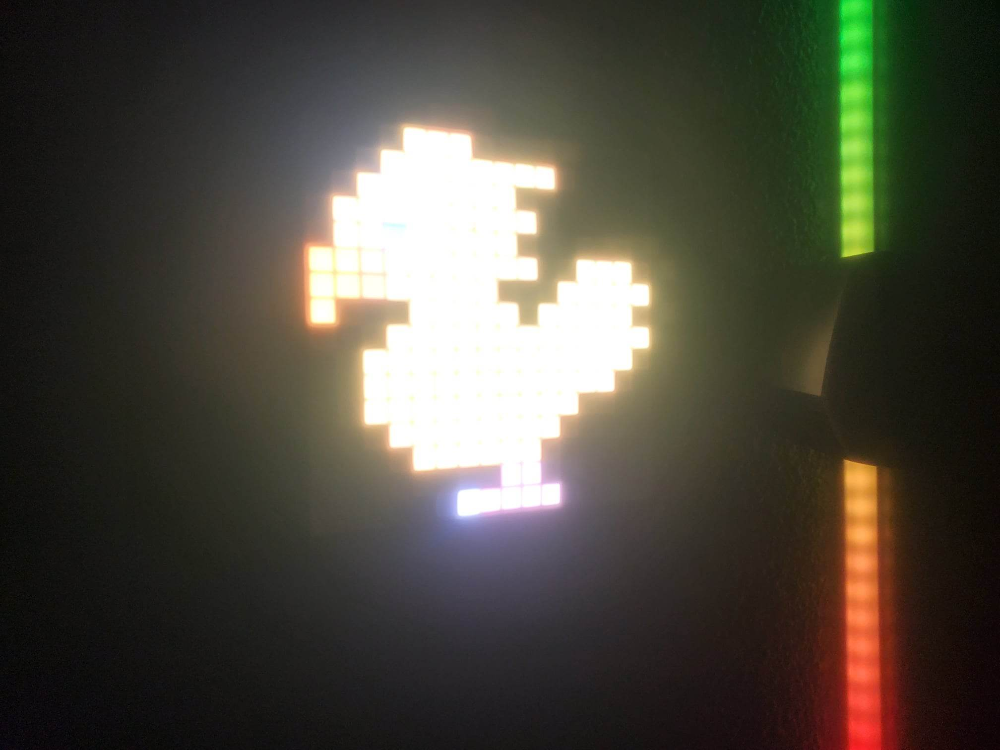
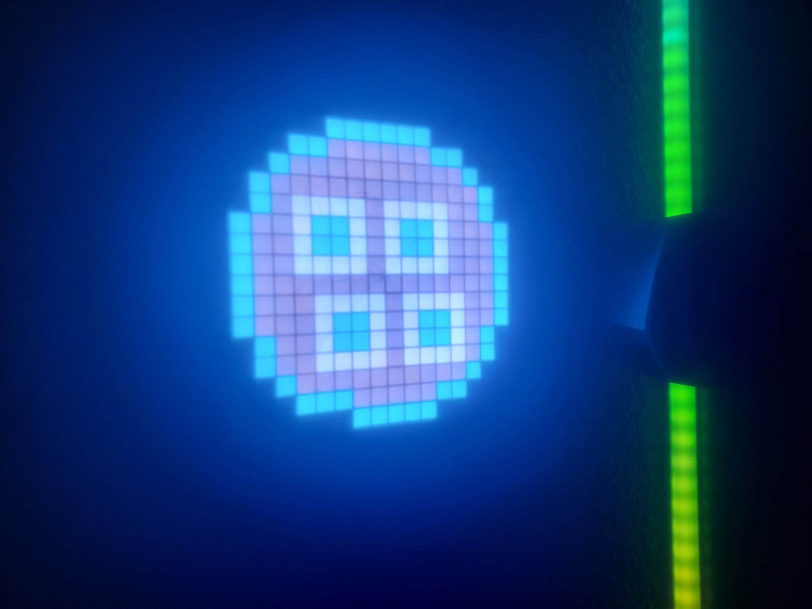
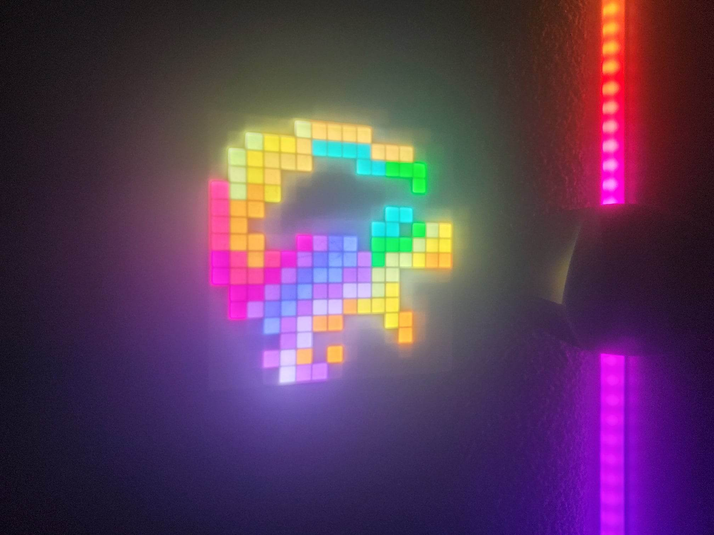
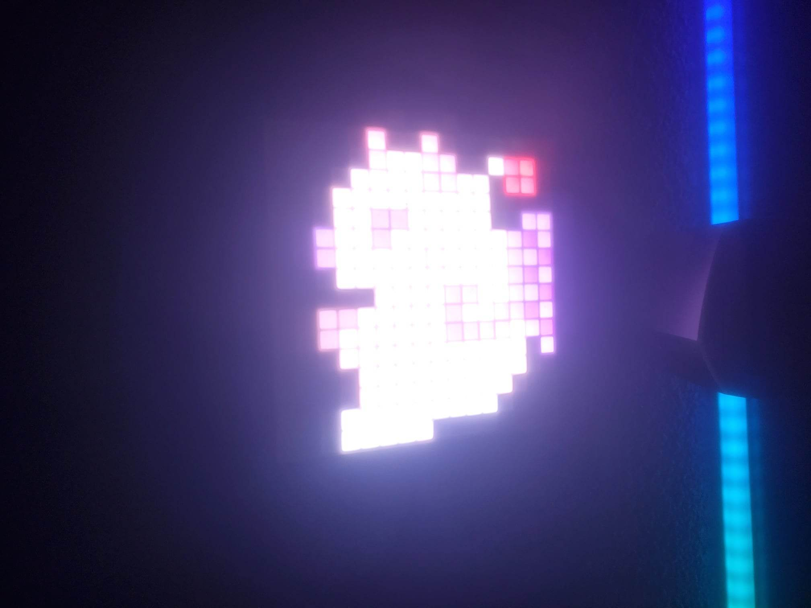

# Matrice LED contrôlée par MQTT avec ESP32 - Concept du projet

Dans ce projet, nous allons créer une matrice LED contrôlée par MQTT qui peut afficher soit un logo, soit des animations, soit les icônes des applications en cours d'utilisation sur votre ordinateur. Pour ce faire, nous allons utiliser un ESP32 connecté à une matrice LED WS2812B de 16x16 pixels, ainsi qu'un ordinateur équipé d'un script Python pour envoyer les informations via MQTT.

L'ESP32 sera programmé pour se connecter à un broker MQTT et attendre des messages contenant des informations sur ce qu'il doit afficher sur la matrice LED. Ces messages seront envoyés par un script Python sur votre ordinateur qui surveille les applications en cours d'utilisation et envoie les informations à l'ESP32 via MQTT.

Vous pourrez choisir entre plusieurs modes d'affichage sur la matrice LED, notamment :

- Mode logo : affiche un logo personnalisé
- Mode animation : affiche une animation de pixels clignotants, défilants, etc.
- Mode icônes d'application : affiche les icônes des applications en cours d'utilisation sur votre ordinateur

Dans les parties suivantes de ce tutoriel, nous allons détailler la configuration de l'ESP32, la connexion de la matrice LED, le script Python pour envoyer les informations via MQTT et la programmation de l'ESP32 pour afficher les informations sur la matrice LED.

# Matrice LED contrôlée par MQTT avec ESP32 - Tutoriel d'installation

Ce tutoriel vous guidera à travers l'installation et la configuration de la matrice LED contrôlée par MQTT avec ESP32. 

## Matériel requis

Avant de commencer, assurez-vous que vous disposez de tout le matériel nécessaire :

- 1 ESP32 (vous pouvez utiliser d'autres cartes de développement, mais assurez-vous qu'elles prennent en charge le protocole MQTT et qu'elles ont suffisamment de broches pour connecter la matrice LED WS2812B)
- 1 matrice LED WS2812B de 16x16 pixels (ou une matrice LED similaire)
- 1 câble USB pour connecter l'ESP32 à votre ordinateur
- 1 alimentation pour la matrice LED (vérifiez les spécifications de la matrice LED pour connaître la tension et le courant nécessaires)
- Des fils de connexion pour connecter l'ESP32 à la matrice LED

Pour créer votre propre tableau hexadécimal, vous devez d'abord créer une image .png de 16 par 16 pixels. Vous pouvez utiliser n'importe quel logiciel d'édition d'images pour cela.

Une fois que vous avez créé votre image .png, vous devez télécharger et installer le logiciel lcd-image-converter à partir du lien suivant : https://lcd-image-converter.riuson.com/en/about/

Une fois que vous avez installé lcd-image-converter, ouvrez votre image .png dans le logiciel. Dans la fenêtre "Prepare Scanning", cochez la case "Use Custom Script" et collez le code suivant :

for (var y = 0; y < image.height; y++) {
if (y % 2 == 0) {
// even rows (0, 2, 4, ...)
for (var x = image.width - 1; x >= 0; x--) {
image.addPoint(x, y);
}
} else {
// odd rows (1, 3, 5, ...)
for (var x = 0; x < image.width; x++) {
image.addPoint(x, y);
}
}
}

Assurez-vous que "Preset" est réglé sur "Color a8r8g8b8". Dans la section "Conversion Options", cliquez sur "Show Preview" pour prévisualiser votre tableau hexadécimal.

Vous pouvez maintenant utiliser le code généré pour votre tableau hexadécimal dans votre projet.

- Un ordinateur avec Arduino IDE et Python installés

Assurez-vous d'avoir tous ces éléments avant de continuer avec la configuration de votre matrice LED.

Dans les parties suivantes de ce tutoriel, nous allons installer les bibliothèques nécessaires, configurer l'ESP32, connecter la matrice LED et programmer l'ESP32 pour contrôler la matrice LED via MQTT.

# Installation d'Arduino IDE

Pour ce projet, nous allons utiliser Arduino IDE pour programmer l'ESP32. Voici les étapes à suivre pour l'installer :

1. Téléchargez Arduino IDE à partir du site web officiel : https://www.arduino.cc/en/software
2. Installez Arduino IDE en suivant les instructions fournies par le programme d'installation.

# Installation des bibliothèques nécessaires

Nous avons besoin de plusieurs bibliothèques pour ce projet. Voici comment les installer :

1. Ouvrez Arduino IDE.
2. Allez dans le menu "Croquis" > "Inclure une bibliothèque" > "Gérer les bibliothèques".
3. Recherchez les bibliothèques suivantes et installez-les :

- Adafruit_NeoPixel
- WiFi
- PubSubClient

# Ajout de l'ESP32 à Arduino IDE

Pour programmer l'ESP32, nous devons ajouter le support pour cette carte à Arduino IDE. Voici comment faire :

1. Ouvrez Arduino IDE.
2. Allez dans le menu "Fichier" > "Préférences".
3. Dans la zone "URL de gestionnaire de cartes supplémentaires", entrez l'URL suivante : https://dl.espressif.com/dl/package_esp32_index.json
4. Cliquez sur le bouton "OK" pour fermer la fenêtre des préférences.
5. Allez dans le menu "Outils" > "Type de carte" > "Gestionnaire de cartes".
6. Recherchez "ESP32" dans la zone de recherche et installez le "ESP32 by Espressif Systems" à partir de la liste des résultats.
7. Sélectionnez "ESP32 Dev Module" dans le menu "Outils" > "Type de carte" pour programmer votre ESP32.

C'est tout ! Vous êtes maintenant prêt à programmer votre ESP32 avec Arduino IDE.

# Personnalisation de la matrice LED contrôlée par MQTT avec ESP32

Pour personnaliser votre matrice LED contrôlée par MQTT avec ESP32, vous pouvez modifier le fichier ESP32_Matrice_LED_Control.ino. Voici les étapes à suivre :

1. Ouvrez le fichier ESP32_Matrice_LED_Control.ino dans Arduino IDE en suivant les instructions données précédemment.
2. Modifiez les valeurs du nom du réseau WiFi et du mot de passe pour correspondre à votre réseau WiFi (ligne 1147).
3. Modifiez les valeurs du nom d'hôte et du port MQTT pour correspondre à votre broker MQTT (ligne 1141).
4. Réglez la luminosité des LED en modifiant la valeur de la ligne 1139.
5. Ajoutez de nouvelles images pour les applications ou les animations en suivant les instructions dans le code.
6. Réglez les valeurs de la vitesse et du temps entre les animations pour correspondre à vos préférences (ligne 1369).

Une fois que vous avez terminé de personnaliser le code, téléversez-le sur votre ESP32 et profitez de votre matrice LED personnalisée !

Notez que le code est commenté pour vous aider à comprendre chaque section et à effectuer les modifications nécessaires. N'hésitez pas à expérimenter et à créer vos propres images et animations pour votre matrice LED contrôlée par MQTT avec ESP32.

Vous pouvez trouver les fichiers 3D pour imprimer le boîtier de la matrice LED personnalisée dans le dossier "fichier 3d". Deux versions sont disponibles : une à accrocher et fixer au mur et une pour poser sur votre bureau. N'hésitez pas à les télécharger et à les imprimer pour compléter votre matrice LED personnalisée !

Cette partie de personnalisation de la matrice LED contrôlée par MQTT avec ESP32 est maintenant terminée. Passons maintenant à la partie sur ce qu'il faut installer sur votre PC et comment envoyer les données sur MQTT depuis votre PC.

Pour utiliser le script LanceurMQTT.py, vous devrez modifier certains paramètres pour qu'ils correspondent à votre environnement.

Voici les étapes à suivre pour modifier le script :

Ouvrez le fichier LanceurMQTT.py dans votre éditeur de texte préféré.
Modifiez les valeurs de l'adresse IP et du port de votre broker MQTT pour correspondre à votre broker.
Modifiez le nom d'utilisateur et le mot de passe de votre broker MQTT pour correspondre à vos informations d'identification.
Enregistrez les modifications apportées au fichier.
Une fois que vous avez terminé de modifier le fichier, vous pouvez l'exécuter pour envoyer des messages MQTT à votre ESP32 et contrôler votre matrice LED.

Notez que le script est commenté pour vous aider à comprendre chaque section et à effectuer les modifications nécessaires. N'hésitez pas à expérimenter et à personnaliser le script en fonction de vos besoins.

Pour créer un exécutable à partir du fichier LanceurMQTT.py que vous avez personnalisé, vous pouvez utiliser PyInstaller. PyInstaller est un outil qui vous permet de créer des exécutables à partir de scripts Python.

Voici les étapes à suivre :

Ouvrez une invite de commande ou un terminal et accédez au répertoire où se trouve votre script LanceurMQTT.py.
Installez PyInstaller en utilisant la commande pip install pyinstaller.
Tapez la commande suivante pour créer l'exécutable : pyinstaller --onefile LanceurMQTT.py
Une fois que la commande a été exécutée avec succès, vous trouverez un nouveau dossier appelé "dist" dans le même répertoire que votre script LanceurMQTT.py. Dans ce dossier, vous trouverez le fichier exécutable pour votre script.
Vous pouvez maintenant exécuter cet exécutable en double-cliquant dessus ou en l'exécutant depuis une invite de commande ou un terminal.
Notez que vous devrez peut-être modifier les paramètres PyInstaller en fonction de vos besoins, tels que l'inclusion d'autres fichiers ou la personnalisation de l'icône de l'exécutable. Vous pouvez trouver plus d'informations sur les options PyInstaller dans la documentation officielle de PyInstaller.

Pour que le fichier .exe que vous avez créé s'exécute automatiquement au démarrage de votre ordinateur, vous pouvez suivre les étapes suivantes:

Ouvrez le menu Démarrer et tapez "Exécuter" dans la barre de recherche. Cliquez sur l'application "Exécuter" qui apparaît.

Dans la fenêtre "Exécuter", tapez "shell:startup" et cliquez sur "OK". Cela ouvrira le dossier de démarrage de votre ordinateur.

Copiez le fichier .exe que vous avez créé dans le dossier de démarrage.

Redémarrez votre ordinateur et le fichier .exe devrait s'exécuter automatiquement au démarrage.

Notez que si vous souhaitez désactiver l'exécution automatique du fichier .exe, vous pouvez simplement supprimer le fichier du dossier de démarrage.

Pour envoyer des commandes à votre matrice LED via MQTT, vous pouvez publier des messages sur le topic "MatriceLed" avec les commandes suivantes :

"modeoff" : pour éteindre la matrice LED
"modeapplication" : pour passer en mode application
"modeanimation" : pour passer en mode animation
"modelogo" : pour afficher le logo de la matrice LED
Vous pouvez utiliser n'importe quel moyen pour publier ces messages MQTT, que ce soit un dashboard sur votre système domotique ou un autre programme que vous avez créé. Assurez-vous simplement que le message est publié sur le topic "MatriceLed" avec la commande appropriée pour contrôler votre matrice LED.

Félicitations ! Vous avez terminé le tutoriel pour personnaliser votre matrice LED contrôlée par MQTT avec ESP32 et l'envoi de commandes par MQTT depuis votre ordinateur. Vous avez appris comment personnaliser le code Arduino pour contrôler votre matrice LED, comment créer un script Python pour envoyer des commandes MQTT et comment exécuter automatiquement le script au démarrage de votre ordinateur. Nous espérons que vous apprécierez l'utilisation de votre matrice LED personnalisée et que vous continuerez à explorer les possibilités offertes par l'IoT et la domotique.

  
  
  
  

